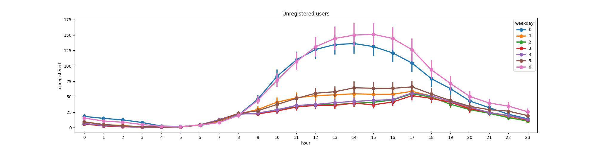

# Bike Utilization Prediction

Build a prediction model for the hourly utilization “cnt” of this data set: https://archive.ics.uci.edu/ml/datasets/Bike+Sharing+Dataset.
I have save the local copy of the dataset in project under folder `bike_sharing_dataset`

I have created a pipeline with the following components:

#### DataLoader
Responsible for loading the data from the source. In the current problem we are loading the data from CSV file.
This component can be extended to load the data from different sources like database, cloud buckets.

#### Preprocessing
Responsible for filtering data. In the current problem, it is removing redundant column and renaming some of the colums.

#### Exploratory Data analysis
Responsible for plotting different metrices and understand relation between the data.

#### Feature Engineering
Processing features before feeding it the ML algorithm.

#### Model Generation & Prediction
Responsible for generating the model and provide prediction. In real case scenarios it can be divided into two parts.
First part will be responsible for training and saving the model and in second part, we can load the model
and perform prediction.

I have used RandomForestRegressor model with hypertuning of parameters as it performs well with Nonlinear Relationships
and its Robustness to Overfitting. In prod, my idea will be to run multiple models in parallel with tools like https://www.kubeflow.org/[Kubeflow]
and find out which one performs better.

## Exploratory Data analysis

image::plots/weekly_usage.png[]

## Part 2 : Scalability and Robustness

Q- What are the scaling properties of your model, if you assume that the amount of data you need to handle go up to several terabytes? Do you see any problems?

The current solution is using small dataset. To get in scaled and handle up to several terabytes of data, we can use Apache Spark.
Apache Spark has a https://spark.apache.org/docs/latest/ml-classification-regression#random-forest-regression[MLLib] module and we
can do the preprocessing and model generation in distributed manner. I have used Google cloud platform and submitted apache spark jobs in
DataProc clusters. We can create a DataProc cluster with Node pools consists of different machine sized and can define number of executor to process the data.
I have also used https://www.kubeflow.org/[Kubeflow] as Machine learning orchestration tool and created multiple self-service API's and pipelines. In this specific case -
we can create an API wrapper and user/clients can trigger the pipeline by himself.

Q- How would you address these problems? Are there technologies for data storage/predictive modelling you can build upon? Describe how the technologies you mention solve the scaling problems you see with model.

Please find the problems below:

- Calculate the Spark correct number of executors and memory in advance. It will help you to use spark cluster resources efficiently.
- If one job is already running and occupying all the cluster resources and in the meantime other job wants to access the resources , they will be in queue.
we have to make sure that it is not creating deadlocks.
- Monitoring of autoscaling of the nodes.
- Creating alert mechanism and integrate will slack, msteams so in case of issue, respective stakeholders are aware about the issue.

Do you have hands-on experience with such technologies? Which ones? For how long?

I have experience with Apache Spark, Kubeflow, Jupyter notebooks and other similar technology stack.
I am working in ML domain since past 8 years.

## Next Steps

- Added required logging for debugging.
- As a next step, we can create a docker image and can deploy on Kubernetes cluster.
- Configure Kubernetes cluster with autoscaling to add/remove nodes based on the traffic .
