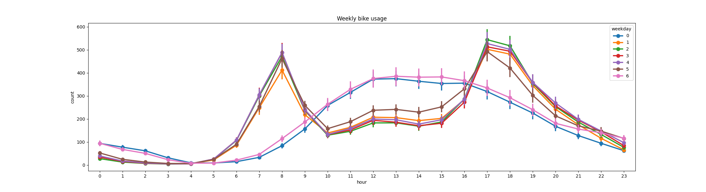

# Bike Utilization Prediction

Build a prediction model for the hourly utilization “cnt” of this data set: https://archive.ics.uci.edu/ml/datasets/Bike+Sharing+Dataset.
I have save the local copy of the dataset in project under folder `bike_sharing_dataset`

Exploratory Data analysis

image::plots/correlation.png[]

image::plots/monthly_count.png[]

image::plots/registered_users.png[]

image::plots/unregistered_users.png[]

image::plots/weekly_count.png[]

## Part 2 : Scalability and Robustness

The current solution is using small dataset. To get in scaled and handle up to several terabytes of data, we can use Apache Spark.
Apache Spark has a https://spark.apache.org/docs/latest/ml-classification-regression#random-forest-regression[MLLib] module and we
can do the preprocessing and model generation in distributed manner. I have used Google cloud platform and submitted apache spark jobs in
DataProc clusters. We can create a DataProc cluster with Node pools consists of different machine sized and can define number of executor to process the data.
I have also used https://www.kubeflow.org/[Kubeflow] as Machine learning orchestration tool and created multiple self-service API's and pipelines. In this specific case -
we can create an API wrapper and user/clients can trigger the pipeline by himself.

One of the challenge with the approach is to calculate the correct number of executors and memory in advance.
If one job is already running and occupying all the cluster resources and in the meantime other job wants to access the resources.
It will be in queue.
Montioring of autoscaling of the nodes.
We should have monitoring mechanism in place.

I have experience with Apache Spark, Kubeflow, Jupyter notebooks and other similar technology stack.
I am working in ML domain since past 8 years.

## Next Steps

- Added required logging for debugging.
- As a next step, we can create a docker image and can deploy on Kubernetes cluster.
- Configure Kubernetes cluster with autoscaling to add/remove nodes based on the traffic .
